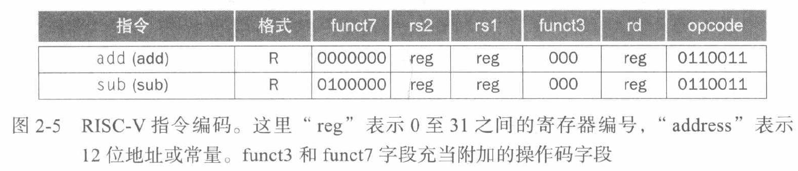
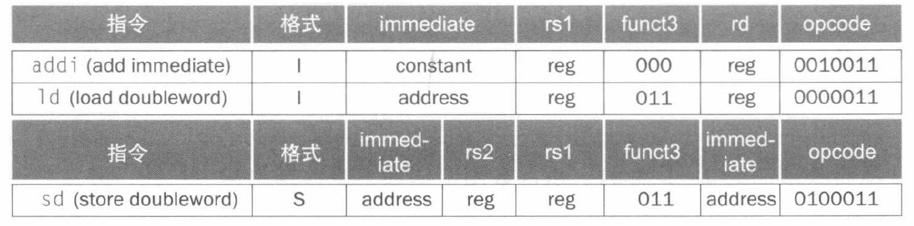

# 第二章：指令

## 2.2 计算机硬件的操作
硬件设计基本原则1：**简单源于规整**

## 2.3 计算机硬件的操作数
算术指令的操作数必须取自寄存器，在rv64中寄存器的大小是64字节，被称为双字（rv32同理被称为字）。risc-v体系结构通常是32个64位寄存器。
32个的原因就是第二个设计原则：**更少则更快**。
要在更多寄存器的方便性与更少寄存器能缩短的时钟周期程度之间取得平衡。
### 2.3.1 存储器操作数
计算机如何访问更大的数据结构？（数组/结构体）：存在内存，所以计算机指令系统需要访问内存的指令
将数据从内存复制到寄存器的指令是`load`，实际是ld
`软硬件接口`:几乎所有体系结构都按单个字节寻址，一个双字差8字节，所以每个双字的地址之间差8

另外，计算机分“大端序”和“小端序”。大端序是使用大端作为双字地址，小端序是使用小端作为双字地址，risc-v属于小端序。
仅仅在以8个字节或者双字的方式访问数据时才需要考虑端续

注意risc-v地址按字节编号，即使一个数组，元素是双字即8*8=64字节，访问A[8]的时候也不能写8(x22)要写成64(x22)，x22是存数组A的基址寄存器
与载入指令相反的存储指令，在risc-v体系中实际上是sd，表示存储双字

### 2.3.2 常数或立即数操作
避免从内存加载常数到寄存器，引入加立即数指令，即addi
由于常数0经常被使用，所以risc-v专门用寄存器x0硬连线到常数0，也是`加速经常性事件`的一个实例


注：进入 64 位时代后，指针虽然通常变成了 64 位，但 C 里的 int、long、long long 并没有统一成一样大；不同系统选择不同，所以编写程序时必须明确类型大小，尤其在数组下标、长度、地址和类型转换这些地方，应该优先使用 size_t 等更合适的类型。(rust里是uszie)
```c
for (int i=0;i<n;i++){
    ...
}
```
就不够严谨
```c
for(size_t i=0;i<n;i++){
    ...
}
```
是更严谨的写法

## 2.4 有符号数与无符号数
计算机中所有信息都由二进制数表示，一个比较有意思的表述是，在数学上一个二进制数是有无穷大的位数的，只是迫于硬件的限制只能表示少数最右的几位，当最右的几位表示不了这个数的时候就发生了`溢出`。
计算机中表示正负数，最初用`原码`来解决，就是单独用一位来表示符号，然后由于有正负零等等问题选择使用`补码`：前导0表示正数，前导1表示负数
这样的话，假设这个二进制数有n位，则其能表示的正数最大到 $2^{n-1}-1$，能表示的负数最小到 $-2^{n-1}$，这样 $-2^{n-1}$ 就没有对应的相反的正数
二进制补码的优点是，硬件只需要检测最高位就能判断正负
正如无符号数可能超出硬件的容量，有符号数的符号位错误也会产生溢出，比如负数的符号位变成了0或者正数的符号位变成了1
这里有一个`软硬件接口`：当从内存读一个宽度较小的数到寄存器时，需要补高位，如果把他当作有符号数，就要`符号扩展`，当作无符号数就要`零扩展`。RISC-V 用 `lb`(load byte) 表示有符号字节载入，用 `lbu`(load byte unsigned) 表示无符号字节载入。
在C语言中常用单一字节表示字符，而我们载入字符的时候不希望他做符号扩展，所以我们一般用lbu

## 2.5 计算机中的指令表示
R型指令：（用于寄存器）
| funct7 | rs2 | rs1 | funct3 | rd | opcode |
| --- | --- | --- | --- | --- | --- |
| 7位 | 5位 | 5位 | 3位 | 5位 | 7位 |

I型指令（带一个常数）
| immediate | rs1 | funct3 | rd | opcode |
| --- | --- | --- | --- | --- |
| 12位 | 5位 | 3位 | 5位 | 7位 |

立即数字段为补码，所以可以表示 $-2^{11}$ 到 $2^11$的数

另外还需要存储双子的指令sd，需要两个源寄存器
S型指令
| immediate[11:5] | rs1 | rs2 | funct3 | immediate[4:0] | opcode |
| --- | --- | --- | --- | --- |
| 7位 | 5位 | 5位 | 3位 | 5位 | 7位 |

把立即数分成了两个字段，为了保持rs1和rs2在相同的位置，降低硬件的复杂性
指令类型以及操作通过操作码来区分

